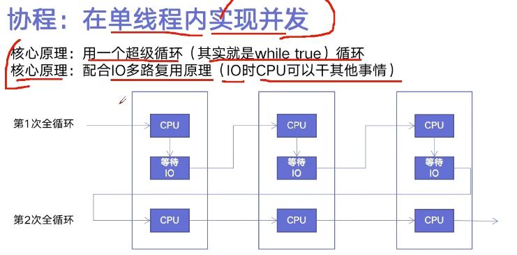
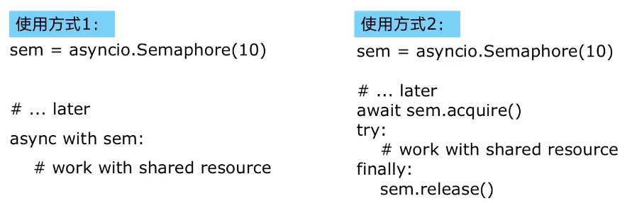

## 协程 ：在单线程内实现并发

核心原理: 用一个超级循环（其实就是 while true）循环
核心原理：配合 IO 多路复用原理（IO 时 CPU 可以干其他事情）


也叫异步操作

```python
import asyncio

# 获取事件循环
loop = asyncio.get_event_loop()

# 定义协程
async def myfunc(url):
    await get_url(url)

# 创建task列表
tasks = [loop.create_task(myfunc(url)) for url in urls]

# 执行爬虫事件列表
loop.run_until_complete(asyncio.wait(tasks))
```

注意：

要用在异步 IO 编程中依赖的库必须支持异步 IO 特性
爬虫引用中: Requests 不支持异步需要用 aiohttp

## 信号量 （英语：Semaphore）

信号量（英语：Semaphore）又称为信号量、旗语。也叫 PV 操作

是一个同步对象，用于保持在 0 至指定最大值之间的一个计数值。

- 当线程完成一次对该 semaphore 对象的等待（wait）时，该计数值减一；
- 当线程完成一次对 semaphore 对象的释放（release）时，计数值加一。
- 当计数值为 0，则线程等待该 semaphore 对象不再能成功直至该 semaphore 对象变成 signaled 状态
- semaphore 对象的计数值大于 0，为 signaled 状态；计数值等于 0，为 nonsignaled 状态.


